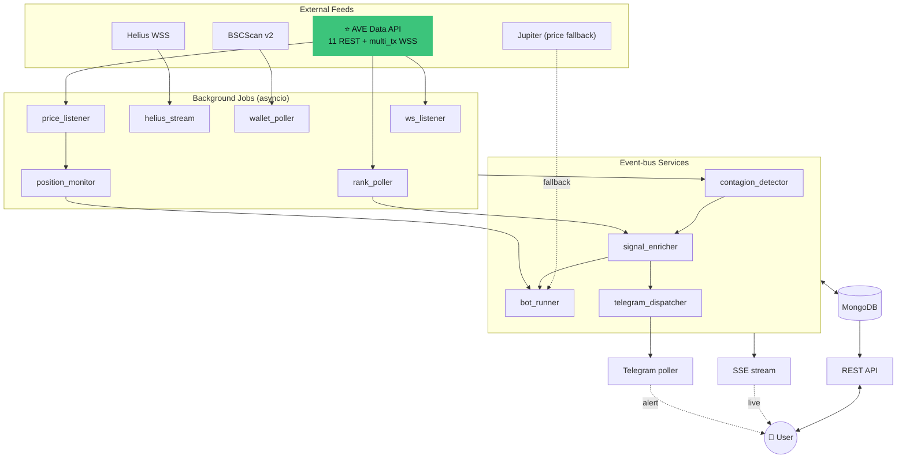

# Coven Backend

**FastAPI service that powers Coven — on-chain alpha intelligence for Solana + BNB Chain.**

This is the engine behind [usecoven.vercel.app](https://usecoven.vercel.app/). It ingests every swap from tracked smart-money wallets, runs three independent signal algorithms over the stream, executes paper trades on behalf of user-created bots, and dispatches Telegram alerts — all in a single live loop.

🏆 Built for the **AVE × CLAW Hackathon**. AVE is the primary data source: 11 of 16 documented REST endpoints + the live `multi_tx` WebSocket stream.

[Frontend repo →](https://github.com/victorjayeoba/coven-frontend) · [Live site →](https://usecoven.vercel.app/) · [Demo video →](https://res.cloudinary.com/dsywwgmcs/video/upload/v1776271910/edited_video_ean77f.mp4)

---

## Table of contents

1. [What this does](#what-this-does)
2. [Architecture at a glance](#architecture-at-a-glance)
3. [Project layout](#project-layout)
4. [Setup](#setup)
5. [Environment variables](#environment-variables)
6. [Running with Docker](#running-with-docker)
7. [Background jobs](#background-jobs)
8. [API surface](#api-surface)
9. [Event bus](#event-bus)
10. [Deployment](#deployment)
11. [Common operations](#common-operations)
12. [Troubleshooting](#troubleshooting)

---

## What this does

A continuous detection-to-action loop:

```
Smart-money wallet swaps a token
   ↓ (Helius / AVE WSS — sub-second)
Background jobs ingest + normalize the swap
   ↓
contagion_detector / rank_poller score the move
   ↓
SIGNAL_FIRED → signal_enricher → SIGNAL_SCORED
   ↓
bot_runner opens paper trades for matching user bots
telegram_dispatcher DMs alerts to opted-in users
SSE stream pushes everything to open browser tabs
```

End-to-end latency: typically **under 2 seconds** from on-chain confirmation to the user's screen.

## Architecture at a glance



## Project layout

```
backend/
├── app/
│   ├── main.py                 # FastAPI app + lifespan (boots all jobs)
│   ├── config.py               # Settings (env vars via pydantic)
│   ├── auth/                   # JWT + cookie deps + password hashing
│   ├── db/                     # MongoDB connection (motor async)
│   ├── models/                 # User, signal, trade, bot pydantic models
│   ├── routers/                # FastAPI route modules
│   │   ├── auth.py             # /api/auth/{signup,signin,me,logout}
│   │   ├── signals.py          # /api/signals/{live,...}
│   │   ├── tokens.py           # /api/tokens/{trending,movers,search,...}
│   │   ├── trades.py           # /api/trades/{active,history,pnl,open,close}
│   │   ├── bots.py             # /api/bots — CRUD for signal/copy bots
│   │   ├── telegram.py         # /api/telegram link + prefs
│   │   ├── balance.py          # /api/balance — paper wallet ops
│   │   ├── settings.py         # /api/settings — user preferences
│   │   ├── stream.py           # /api/stream/signals — SSE
│   │   ├── system.py           # /api/system/next-scan-at — countdown
│   │   ├── clusters.py         # /api/clusters
│   │   ├── wallets.py          # /api/wallets
│   │   ├── backtests.py        # /api/backtests
│   │   └── health.py
│   ├── jobs/                   # asyncio background jobs
│   │   ├── ws_listener.py      # AVE WSS multi_tx — token-level swaps
│   │   ├── helius_stream.py    # Helius WSS — Solana wallet swaps
│   │   ├── wallet_poller.py    # BSCScan REST + SOL fallback
│   │   ├── price_listener.py   # Live token prices (AVE WSS)
│   │   ├── rank_poller.py      # AVE leaderboard scan every 5 min
│   │   ├── position_monitor.py # TP / SL / trailing stop enforcement
│   │   └── telegram_poller.py  # Inbound TG bot updates
│   └── services/               # In-process event-bus consumers
│       ├── ave_client.py       # ⭐ AVE Data API wrapper
│       ├── event_bus.py        # asyncio pub/sub
│       ├── contagion_detector.py # Cluster signal detection
│       ├── signal_enricher.py  # Conviction scoring
│       ├── bot_runner.py       # Opens paper trades for user bots
│       ├── telegram_dispatcher.py # Fans signals out to TG
│       ├── execution_engine.py # (legacy auto-trader, disabled)
│       ├── exit_monitor.py
│       ├── risk_checker.py
│       ├── balance_ledger.py   # Paper-balance debit/credit
│       ├── graph_builder.py    # Wallet cluster graph builder
│       └── backtester.py
├── scripts/                    # One-off CLI utilities (seed, dedupe, etc.)
├── requirements.txt
├── Dockerfile
└── README.md
```

## Setup

### Prerequisites

| Tool | Version |
|---|---|
| Python | 3.11 |
| MongoDB | ≥ 6 (local or Atlas) |
| AVE Data API key | [ave.ai](https://ave.ai) |
| Helius API key | [helius.dev](https://helius.dev) (optional but recommended) |
| BSCScan API key | [bscscan.com/apis](https://bscscan.com/apis) (optional) |
| Telegram bot token | [@BotFather](https://t.me/botfather) (optional) |

### Local install

```bash
git clone https://github.com/victorjayeoba/coven-backend.git
cd coven-backend

python3 -m venv .venv
source .venv/bin/activate          # Windows: .venv\Scripts\activate
pip install -r requirements.txt

cp .env.example .env               # then fill in your keys
uvicorn app.main:app --reload --port 8000
```

Boot logs you should see (in order):

```
[startup] graph index loaded: {'clusters_loaded': N, ...}
[telegram_dispatcher] registered
[ws_listener] starting
[price_listener] starting
[helius_stream] starting
[rank_poller] starting · interval=300s
INFO:     Application startup complete.
```

API is now live at <http://localhost:8000> · interactive docs at <http://localhost:8000/docs>.

## Environment variables

| Variable | Required | Default | Purpose |
|---|---|---|---|
| `MONGO_URI` | ✅ | `mongodb://localhost:27017` | Mongo connection string |
| `MONGO_DB` | optional | `contagion` | Database name |
| `JWT_SECRET` | ✅ | (dev fallback) | Signing key for session JWTs — **change in prod** |
| `JWT_EXPIRE_MINUTES` | optional | `1440` | Session lifetime |
| `AVE_API_KEY` | ✅ | — | Primary data feed |
| `AVE_BASE_URL` | optional | `https://prod.ave-api.com/v2` | |
| `AVE_WSS_URL` | optional | `wss://wss.ave-api.xyz` | |
| `HELIUS_API_KEY` | recommended | — | Solana wallet WSS — without this copy bots can't track SOL wallets |
| `HELIUS_BASE_URL` | optional | `https://api.helius.xyz` | |
| `BSCSCAN_API_KEY` | recommended | — | BSC wallet polling |
| `WALLET_POLL_INTERVAL_SECONDS` | optional | `10` | How often `wallet_poller` ticks |
| `ENABLE_WALLET_POLLER` | optional | `false` | Force REST polling for SOL too (when WSS down) |
| `ENABLE_TX_POLLER` | optional | `false` | Force per-pair tx REST fallback |
| `TELEGRAM_BOT_TOKEN` | optional | — | Enables outbound TG alerts |
| `TELEGRAM_BOT_USERNAME` | optional | — | For deep-link generation `t.me/<bot>?start=<code>` |
| `CORS_ORIGINS` | optional | `http://localhost:3000` | Comma-separated allowed origins |
| `COOKIE_SECURE` | optional | `false` | Set `true` in production |
| `COOKIE_SAMESITE` | optional | `lax` | `none` for cross-domain |

## Running with Docker

```bash
# Build
docker build -t coven-backend .

# Run (assumes Mongo on host)
docker run -d \
  --name coven-backend \
  -p 8084:8000 \
  --env-file .env \
  --add-host=host.docker.internal:host-gateway \
  --restart unless-stopped \
  --ulimit nofile=65536:65536 \
  coven-backend
```

The `--ulimit` flag is important — without it, the container hits "too many open files" under load (lots of concurrent WebSocket + httpx clients).

When using `MONGO_URI=mongodb://host.docker.internal:27017` the `--add-host` flag lets the container reach a Mongo running on the host machine.

## Background jobs

All jobs are started in `app/main.py:lifespan` and run as long-lived `asyncio` tasks. They communicate via the in-process event bus (no Redis, no broker — direct fanout, sub-millisecond latency).

| Job | Cadence | What it does |
|---|---|---|
| `helius_stream` | live (WSS) | Subscribes to Helius `logsSubscribe` for every tracked Solana wallet. Fetches parsed swaps, normalizes to `SWAP_EVENT`. |
| `ws_listener` | live (WSS) | Subscribes to AVE `multi_tx` for ~145 trending + pump-phase tokens. Source of cluster signals. |
| `price_listener` | live (WSS) | Subscribes to AVE price/volume/tvl updates for the same token set. Drives live UI ticks + position marking. |
| `wallet_poller` | every 10s | REST fallback for BSC (no WSS equivalent). For Solana, only runs if `helius_stream` is disabled. |
| `rank_poller` | every 5 min | Polls 10+ AVE leaderboard topics + per-chain trending + pump-phase. Fires `rank_stack` signals when a token appears on ≥2 topics. |
| `position_monitor` | every 10s | Marks every open paper trade with current price (via AVE batch endpoint) and fires TP / SL / trailing-stop exits. |
| `bot_position_monitor` | every 10s | Same as above but for bot-created trades. |
| `telegram_poller` | live (long-poll) | Inbound TG bot updates — handles `/start <code>` linking and inline button callbacks (Buy / View). |

## API surface

All `/api/*` routes (except `/api/health` + `/api/system/next-scan-at`) require a session JWT in the `coven_session` HTTP-only cookie.

### Auth
- `POST /api/auth/signup`
- `POST /api/auth/signin`
- `POST /api/auth/logout`
- `GET  /api/auth/me`

### Signals + tokens
- `GET  /api/signals` · list with filters (status, conviction, chain)
- `GET  /api/signals/live?minutes=60` · feed for the dashboard table
- `GET  /api/signals/{id}` · single signal detail
- `GET  /api/tokens/movers?chains=solana,bsc` · merged momentum-ranked feed
- `GET  /api/tokens/trending?chain=solana` · raw AVE passthrough
- `GET  /api/tokens/search?q=...&chain=...`
- `GET  /api/tokens/{token_id}` · detail + market stats
- `GET  /api/tokens/{token_id}/candles?interval=60`
- `GET  /api/tokens/{token_id}/risk` · honeypot + ownership checks
- `POST /api/tokens/batch` · batch token-detail lookup
- `GET  /api/tokens/{token_id}/signals` · all signals + backtests for a token

### Trades + bots
- `GET  /api/trades` · everything for the user (signal + bot + manual)
- `GET  /api/trades/active` · open positions
- `GET  /api/trades/history` · closed positions
- `GET  /api/trades/pnl` · aggregate stats (win rate, best/worst, equity)
- `POST /api/trades/open` · manual paper trade (used by Phantom-style swap)
- `POST /api/trades/{id}/close` · manual close
- `GET  /api/bots` · user's bots
- `POST /api/bots` · create signal or copy bot
- `PATCH /api/bots/{id}` · update settings
- `POST /api/bots/{id}/{start|stop}`
- `DELETE /api/bots/{id}`
- `GET  /api/bots/{id}/trades`

### Telegram + settings
- `GET  /api/telegram/config`
- `GET  /api/telegram/status`
- `POST /api/telegram/start-link` · returns deep-link code
- `POST /api/telegram/unlink`
- `PATCH /api/telegram/prefs`
- `POST /api/telegram/test`
- `GET  /api/settings`
- `PATCH /api/settings`

### Balance + system
- `GET  /api/balance` · paper balances per chain
- `POST /api/balance/deposit`
- `POST /api/balance/reset`
- `GET  /api/system/next-scan-at` · public — countdown timer source

### Realtime
- `GET  /api/stream/signals` · SSE feed:
  - `signal.fired` · `signal.scored`
  - `price.update` · `swap`
  - `bot.trade.opened` · `bot.trade.closed` · `bot.updated`

Interactive Swagger docs: <http://localhost:8000/docs>

## Event bus

Internal pub/sub for service decoupling. Located at `app/services/event_bus.py`. Topics:

| Event | Published by | Subscribers |
|---|---|---|
| `SWAP_EVENT` | `ws_listener`, `helius_stream`, `wallet_poller` | `contagion_detector`, `bot_runner` (copy bots) |
| `SIGNAL_FIRED` | `contagion_detector`, `rank_poller` | `signal_enricher`, SSE stream |
| `SIGNAL_SCORED` | `signal_enricher`, `rank_poller` | `bot_runner` (signal bots), `telegram_dispatcher`, SSE stream |
| `PRICE_UPDATE` | `price_listener` | `position_monitor`, SSE stream |
| `BOT_TRADE_OPENED` | `bot_runner` | `telegram_dispatcher`, SSE stream |
| `BOT_TRADE_CLOSED` | `bot_runner` | `telegram_dispatcher`, SSE stream |
| `BOT_UPDATED` | `routers/bots.py` | SSE stream |
| `TRADE_OPENED` / `TRADE_CLOSED` | (legacy execution engine, disabled) | SSE stream |

## Deployment

Currently running on a single VPS via Docker:

- **Backend:** `coven-api.discretliaison.com` → Cloudflare → reverse proxy → Docker container on port `8084`.
- **MongoDB:** separate Docker container on the same host.
- **Frontend:** Vercel, calls backend via Next.js rewrite proxy (`BACKEND_URL` env var).

### Update workflow

```bash
cd ~/coven-backend && git pull && \
docker build -t coven-backend . && \
docker stop coven-backend && docker rm coven-backend && \
docker run -d --name coven-backend -p 8084:8000 \
  --env-file .env --add-host=host.docker.internal:host-gateway \
  --restart unless-stopped --ulimit nofile=65536:65536 \
  coven-backend && \
docker logs -f coven-backend
```

Watch for `[startup] graph index loaded` then Ctrl+C to detach.

## Common operations

```bash
# Tail live logs
docker logs -f coven-backend

# Drop into the container shell
docker exec -it coven-backend /bin/bash

# Restart without rebuilding
docker restart coven-backend

# Mongo CLI from the host
docker exec -it mongodb mongosh contagion

# Clear all signals (useful after schema changes)
docker exec -it mongodb mongosh contagion --eval "db.signals.deleteMany({})"

# Manually trigger the dedupe cleanup
curl -X POST http://localhost:8084/api/signals/dedupe \
  -H "Cookie: coven_session=..."
```

## Troubleshooting

| Symptom | Likely cause | Fix |
|---|---|---|
| `[Errno 24] Too many open files` | Default ulimit too low for the WSS + httpx workload | Add `--ulimit nofile=65536:65536` to `docker run` |
| `[rank_poller] DIAG NO OVERLAP` | AVE leaderboards returning ETH/Base tokens, no SOL/BSC overlap | Wait — usually resolves on next 5-min poll, or expand `TOPIC_HINTS` in `rank_poller.py` |
| `[helius_stream] connection closed` | Helius free tier rate limit or WSS hiccup | Auto-reconnects after 5s — safe to ignore unless persistent |
| `401 Unauthorized` from frontend | Cookie not being sent (cross-domain) | Frontend should call `/api/*` via same-domain proxy (see frontend `next.config.js`) |
| Bot trades all close at -100% instantly | AVE returns `0` price for unindexed pump.fun tokens, position_monitor fires false stop loss | Use a higher `liquidity_min` on the bot, or skip TP/SL for the first 30s |
| Signals fire but no Telegram alerts | User's `conviction_threshold` higher than the signal score | Lower threshold in `/settings` (default 70) |
| `[telegram_dispatcher] bot token missing` | `TELEGRAM_BOT_TOKEN` env var not set | Set it and restart — alerts are silently disabled without it |

---

## License

MIT — built for the AVE × CLAW Hackathon. Credit Coven if you reuse the code.
